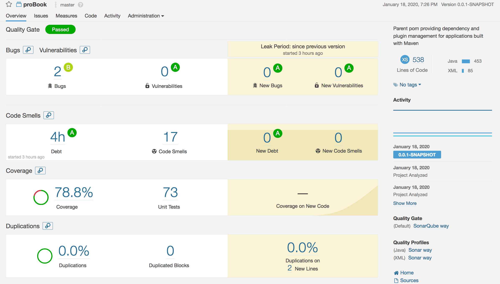

# proBook

## Index

* [Project Overview](#overview)
    * [Task](#task)
    * [Solution](#concept)
    * [Project Planning](#projectplan)
* [The Architecture](#architecture)
    * [Entity Relationship Diagram Initial](#ERDinitial)
    * [Entity Relationship Diagram Initial](#ERDinitial)
    * [API structure](#API)
* [The Technology](#technology)
* [Testing](#testing)
    * [Coverage](#coverage)
* [User Guide](#guide)
    * [Demo](#demo)
    * [Usage](#usage)

## Project Overview
A software based bookmark storage application.

### Task
To create an OOP-based application with utilisation of supporting tools, methodologies and technologies that encapsulate all core modules covered during training.

### Solution
Application that stores bookmarks based upon the type of resource the bookmark correlates to. The bookmark contains a name, description & url, the type has a name, all of which are editable.

### Project Planning
Project Planning was done through the use of [Trello](https://trello.com/b/IN6JKwPY/probook), which contains wireframes, user stories, acceptance criteria and user estimates. The user stories were tagged using a variation of the  MoSCoW method known as the traffic light system with Red = Must, Orange = Should & Green = Could.  

## The Architecture

###  Entity Relationship Diagram Initial

###  Entity Relationship Diagram Final

###  API Architecture

## Development Technology

## Testing

## Test Reports

Back-End : JUnit and Mockito 
Front-End :  Selenium 

A static report was generated using Sonarqube.    
[Static report](./Documentation/SonarQube_Report.png)  

A Surefire report was generated.    
[Surefire report](./Documentation/Surefire_Report_proBook.pdf)

###  Test Coverage

## User Guide

### Demo

### Usage
